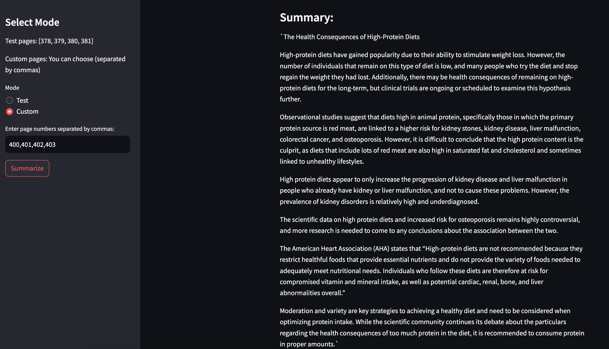

# Technical Test - Connect Think Internship

## Overview
The project consists of a Jupyter notebook where a classification algorithm is developed to determine the quality of wine based on certain wine characteristics. Additionally, an application is built where the user can obtain a summary according to the pages assigned from the following nutrition book: https://pressbooks.oer.hawaii.edu/humannutrition2/ 

## Setup Instructions
1. Clone the Repository:
    ```html
    git clone https://github.com/despinoza119/EDA_and_NLP_test.git
    ```

2. Define the necessary environment variables:
    ```html
    AZURE_DEPLOYMENT=
    AZURE_API_KEY=
    AZURE_ENDPOINT=
    ```

3. Build the docker image:
    ```html
    docker build -t nlp_test .
    ```

4. Run the docker image builded:
    ```html
    docker run -p 8501:8501 nlp_test
    ```

5. To visualize the app go to: http://localhost:8501 :
    ```html
    http://localhost:8501
    ```

## Image of application

